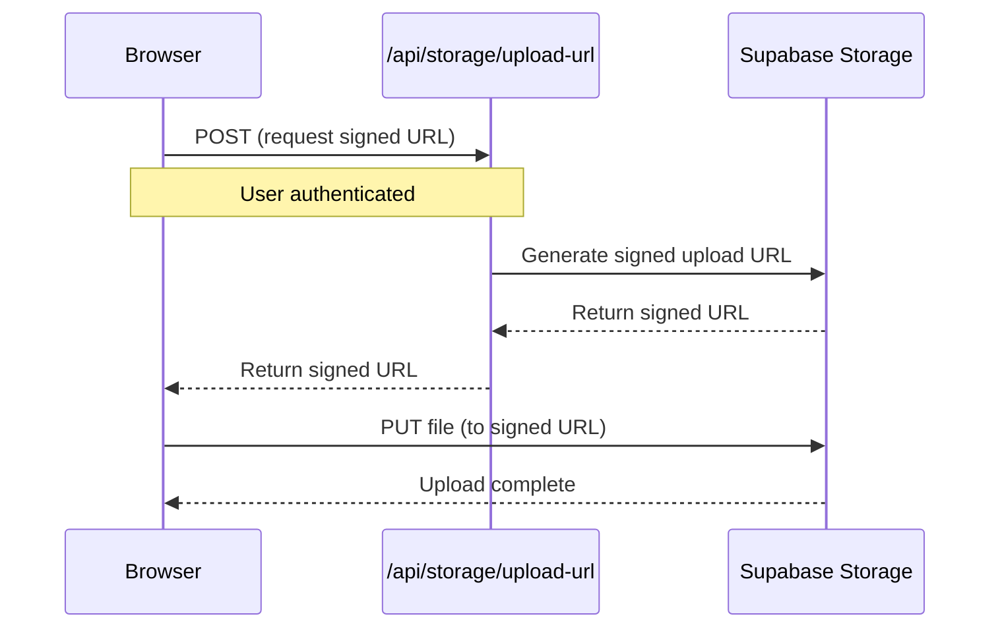

# File Storage Setup

> **Note**: This documentation was updated for Supabase Storage migration.

This project supports **cloud-based file storage** for handling file uploads and downloads using **Supabase Storage**.

## Overview

Files are stored with **public access** by default, making them accessible via URL. This is useful for sharing uploaded content, displaying images, and integrating with external services. Files are organized in user-specific directories for security and access control.

## Storage Backend

The project uses **Supabase Storage** as the primary storage backend:

- **Supabase Storage** - Integrated with your Supabase project (recommended)

Supabase Storage provides built-in CDN, authentication integration, and works seamlessly in both local development and production environments.

## Configuration

### Supabase Setup

Supabase Storage requires the following setup in your Supabase project:

1. **Create Storage Buckets** in your Supabase Dashboard:
   - `user-uploads` - For user-uploaded files (private)
   - `chat-attachments` - For chat attachments (private, scoped to user)
   - `public-assets` - For public files (optional)

2. **Set up RLS Policies** for each bucket:
   - Users can only access files in their own directory
   - Files are organized as `users/{userId}/{path}/{filename}`

3. **Configure Storage Limits**:
   - Set maximum file size (default: 10MB)
   - Configure allowed MIME types
   - Set up quota limits per user

### Quick Start with Supabase Storage

Supabase Storage works seamlessly in both local development and production:

1. Ensure your Supabase project is set up and connected
2. Create the required storage buckets in your Supabase dashboard
3. Run the SQL setup script: `src/services/supabase/_STORAGE_SETUP.sql`
4. File uploads will now work automatically!

No additional environment variables are needed for basic functionality.

## Client Upload

The `useFileUpload` hook **automatically handles uploads** using Supabase Storage:

- **Supabase Storage**: Direct browser → Supabase Storage upload with signed URLs

```tsx
"use client";

import { useFileUpload } from "hooks/use-presigned-upload";

function FileUploadComponent() {
  const { upload, isUploading } = useFileUpload();

  const handleFileChange = async (e: React.ChangeEvent<HTMLInputElement>) => {
    const file = e.target.files?.[0];
    if (!file) return;

    const result = await upload(file, {
      path: "uploads", // Optional: specify upload path
      bucket: "user-uploads" // Optional: specify bucket
    });
    if (!result) return; // Upload failed (error shown via toast)

    // File uploaded successfully
    console.log("Public URL:", result.url);
    console.log("Pathname (key):", result.pathname);
    console.log("File ID:", result.id); // Supabase file ID
  };

  return (
    <input type="file" onChange={handleFileChange} disabled={isUploading} />
  );
}
```

### Upload Flow

#### Supabase Storage (Direct Upload)



### Features

- ✅ **Cloud-Based Storage**: Supabase Storage provides globally distributed CDN
- ✅ **Works Everywhere**: Same storage in development and production
- ✅ **Direct Client Upload**: Browser uploads directly to Supabase Storage (fastest)
- ✅ **Public Access**: All files get public URLs
- ✅ **Authentication**: Users must be logged in to upload
- ✅ **User Isolation**: Files organized by user ID for security
- ✅ **Type Safety**: Full TypeScript support with unified interface
- ✅ **File Validation**: Server-side validation of file types and sizes
- ✅ **Signed URLs**: Secure direct uploads with time-limited access

## Server-Side Upload

For server-side uploads (e.g., programmatically generated files):

```ts
import { uploadFileFromBuffer } from "@/services/supabase/storage-service";

const result = await uploadFileFromBuffer(buffer, "generated", "image/png");

console.log("Public URL:", result.url);
console.log("File path:", result.path);
```

## Advanced Usage

### Using Different Buckets

```tsx
const result = await upload(file, {
  path: "attachments",
  bucket: "chat-attachments" // Use chat attachments bucket
});
```

### File Management

```tsx
import {
  deleteFile,
  listFiles,
  getSignedDownloadUrl
} from "@/services/supabase/storage-service";

// List user files
const files = await listFiles("uploads");

// Delete a file
await deleteFile("users/user-id/uploads/file.jpg");

// Get download URL with expiration
const downloadUrl = await getSignedDownloadUrl("file.jpg", "user-uploads", 3600);
```

### Storage Configuration Check

```tsx
import { checkStorageConfiguration } from "@/services/supabase/storage-service";

const config = await checkStorageConfiguration();
if (!config.isValid) {
  console.error("Storage not configured:", config.error);
  // Show setup instructions to user
}
```

## Why Supabase Storage?

Supabase Storage is chosen because:

1. **Integrated Authentication**: Seamlessly works with Supabase Auth
2. **Built-in CDN**: Files are globally distributed automatically
3. **Database Integration**: Easy to link files with database records
4. **Row Level Security**: Files inherit user permissions
5. **Development Friendly**: Works locally and in production without extra setup

**Benefits over other solutions**:
- No separate service credentials needed
- Unified permissions model
- Better integration with existing Supabase setup
- Cost-effective with Supabase's pricing model
